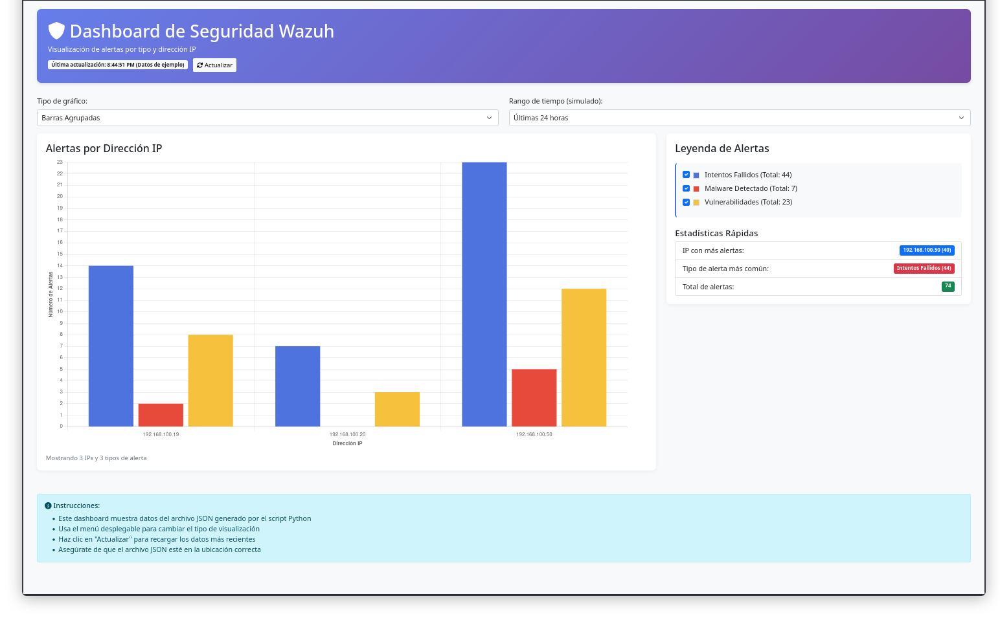

# 🚀 Wazuh Dashboard Lite

**A lightweight, real-time dashboard for visualizing security alerts from Wazuh.**

[](https://www.python.org/)
[](LICENSE)
[](https://wazuh.com/)

> **Lightweight alternative** to the official Wazuh dashboard. Simple to deploy, easy to customize.

## ✨ Features

- **🖥️ Real-time Visualization**: Interactive charts using Chart.js with automatic updates
- **📊 Multi-alert Classification**: Categorizes alerts (failed logins, malware, vulnerabilities, etc.)
- **⚡ Lightweight Deployment**: Single Python file + web server (no heavy dependencies)
- **🔌 Flexible Data Sources**: Works with local JSON files or Wazuh API
- **🎨 Clean Interface**: Modern Bootstrap-based UI with responsive design
- **🔧 Easy Customization**: Simple to add new alert types or visualizations

## 📸 Dashboard Preview



## 🚀 Quick Start

### Prerequisites
- Python 3.8 or higher
- Access to Wazuh alerts (local JSON files or API access)

### Installation & Running

```bash
# Clone the repository
git clone https://github.com/mrodripy/wazuh-dashboard-lite.git
cd wazuh-dashboard-lite

# Install dependencies
pip install -r requirements.txt

# Generate sample data (for testing)
python src/generate_chart_data.py --sample

# Launch the dashboard
python -m http.server 8080

Then open http://localhost:8080/src/ in your browser.
🏗️ Project Structure
text

wazuh-dashboard-lite/
├── src/                    # Source code
│   ├── dashboard.html     # Main dashboard interface
│   ├── generate_chart_data.py  # Alert processor
│   └── styles.css         # Custom styles (optional)
├── examples/              # Example data and configurations
│   └── wazuh_chart_data_enhanced.json
├── config/                # Configuration templates
│   └── settings.example.json
├── tests/                 # Test files
├── docs/                  # Documentation
│   └── images/           # Screenshots
├── requirements.txt       # Python dependencies
├── setup.py              # Package installation
├── LICENSE               # MIT License
└── README.md             # This file

🔧 Configuration
Option 1: Local Alert Files (Recommended for Simple Deployments)
python

# In src/generate_chart_data.py, set your alert file path:
ALERT_PATH = "/var/ossec/logs/alerts/alerts.json"

Option 2: Wazuh API (For Remote or Distributed Setups)
bash

python src/generate_chart_data.py \
  --api \
  --url https://your-wazuh-manager:55000 \
  --user api-user \
  --password your-password

Option 3: Docker Deployment
dockerfile

# Coming soon! Containerized deployment for easy scaling.

📊 Supported Alert Types
Alert Category	Detection Patterns	Example Rules
Failed Attempts	SSH failures, invalid logins, wrong passwords	SSH login failures, Windows logon failures
Malware Detections	Virus, trojan, ransomware alerts	ClamAV detections, suspicious processes
Vulnerabilities	CVE mentions, exploit attempts	Vulnerability scanners, exploit attempts
Windows Events	Critical Windows security events	Event IDs 4625, 4688, 4700
Network Scans	Port scans, reconnaissance	NMAP detection, port sweep alerts
🔄 Update Schedule

The dashboard can be configured to update automatically:
bash

# Update every 5 minutes (add to crontab)
*/5 * * * * cd /path/to/wazuh-dashboard-lite && python src/generate_chart_data.py

🤝 Contributing

Contributions are welcome! Please feel free to submit a Pull Request.

    Fork the repository

    Create your feature branch (git checkout -b feature/AmazingFeature)

    Commit your changes (git commit -m 'Add some AmazingFeature')

    Push to the branch (git push origin feature/AmazingFeature)

    Open a Pull Request

📄 License

This project is licensed under the MIT License - see the LICENSE file for details.
🙏 Acknowledgments

    Wazuh for the amazing open-source security platform

    Chart.js for beautiful, interactive charts

    Bootstrap for responsive UI components

    All contributors and users of this project

Maintained by mrodripy - A lightweight, practical dashboard for Wazuh security monitoring.
